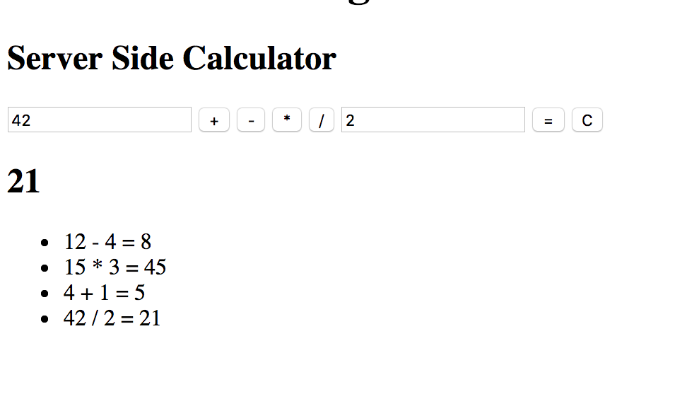

# Sever Side Calculator

## Description
A basic calculator that can do addition, subtraction, multiplication, and division. The client side takes in the input values and makes an AJAX POST request to the server side which does all the calculations and saves the data in an array. After the client sides POST request it makes a GET request to receive the calculations and answers from the server and then displays it on the DOM.

---

---

### Steps

- [x] npm init --yes
- [x] npm install express
- [x] make server folder, server.js
- [x] make public folder
- [x] make server, styles, venders folders
- [x] make html, css, client files
- [x] source libraries
- [x] spin up server
- [x] create user inputs (2 inputs, 6 buttons)
- [x] function to take in input values
- [x] AJAX to POST route
- [x] server side array to hold numbers
- [x] make functions for logic (addition, subtraction, multiplication, and   division)
- [x] make POST
- [x] make GET
- [x] append to DOM